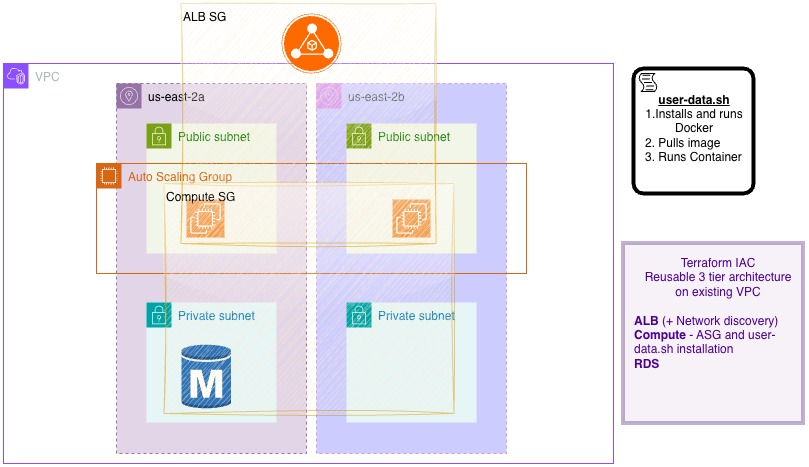

Based on your project structure and the details provided, here is a polished, professional `README.md` file. I have improved the flow, added technical formatting, and integrated the reference to your architecture diagram.

```markdown
# 3-Tier Reusable AWS Architecture (Terraform)

## Overview

This project provides a modular, reusable Infrastructure as Code (IaC) solution for deploying a secure 3-tier application on AWS using Terraform. It is designed to be flexible and easily orchestrated, consisting of three distinct modules: **Networking (ALB)**, **Compute (ASG)**, and **Database (RDS)**.

The architecture is built on a "Hub and Spoke" network discovery model, where the Networking module automatically discovers the appropriate subnets within an existing VPC and exposes them to the Compute and Database layers.

## Architecture



The solution implements a standard 3-tier web architecture:
* **Load Balancing Layer:** Handles incoming traffic and routes it to healthy instances.
* **Compute Layer:** Scalable EC2 instances running Docker containers, isolated from direct internet access (traffic allowed only from ALB).
* **Data Layer:** Private RDS database, accessible only by the Compute layer.

## Modules Breakdown

### 1. ALB (Network & Discovery Hub)
This module acts as the entry point and discovery mechanism for the infrastructure.
* **Network Discovery:** It prompts for a `vpc_id` and automatically scans for available subnets. It intelligently groups subnets by Availability Zone to ensure high availability.
* **Load Balancer:** Provisions an Application Load Balancer (ALB) connected to public subnets.
* **Security:** Creates a security group allowing HTTP traffic from the internet (`0.0.0.0/0`).

### 2. Compute (Application Layer)
This module manages the application logic and scaling.
* **Auto Scaling:** Deploys an Auto Scaling Group (ASG) and Launch Template to ensure application availability.
* **Dynamic User Data:** Includes a robust `user-data.sh` script that:
    * Installs and configures Docker.
    * Accepts dynamic variables for the **Registry URL** (supports Docker Hub & ECR), **Image Name**, and **Image Tag**.
    * Performs secure ECR login if a private registry is detected.
    * Runs the specified container on the defined port.
* **Security:** Instances are launched in Public Subnets (for internet access to pull images) but are secured via Security Groups to accept ingress traffic **only** from the ALB. IAM roles are attached for SSM access and ECR pulling permissions.

### 3. RDS (Persistence Layer)
This module handles data storage.
* **Database:** Launches a managed AWS RDS instance running **PostgreSQL 16**.
* **Security:** The instance is placed in a **Private Subnet** for maximum security. Its Security Group is strictly configured to allow traffic on port `5432` **only** from the Compute Security Group.

## Prerequisites

Before deploying, ensure you have the following:

* **AWS Account:** An active AWS subscription with sufficient permissions.
* **Terraform:** Installed locally (v1.0+).
* **Existing VPC:** A VPC configured with:
    * At least **2 Public Subnets** (in different Availability Zones).
    * At least **2 Private Subnets** (in different Availability Zones).
    * **IMPORTANT:** The Public Subnets must have **"Auto-assign public IPv4 address"** enabled for the network discovery logic to function correctly.

## Operation & Deployment

The `live-demo` directory contains the orchestration files that connect the modules together.

1. **Clone the repository:**
   ```bash
   git clone <repository-url>
   cd live-demo

```

2. **Initialize Terraform:**
Download provider plugins and initialize the backend.
```bash
terraform init

```


3. **Plan the Deployment:**
Preview the resources to be created.
```bash
terraform plan

```


4. **Apply Configuration:**
Run the deployment. You will be prompted for the following inputs:
```bash
terraform apply

```


**Required Inputs:**
| Variable | Description | Default |
| :--- | :--- | :--- |
| `vpc_id` | The ID of your existing VPC (e.g., `vpc-0xxxx`) | **None** |
| `image_registry` | URL of the image registry. Leave empty for Docker Hub. | `""` |
| `image_name` | The name of the Docker image to pull (e.g., `nginx`). | **None** |
| `image_tag` | The tag/version of the image. | `latest` |
| `db_password` | Master password for the RDS database. | **None** (Sensitive) |
*(Note: The container port is automatically set to port 80 by default)*
5. **Access the Application:**
Once deployment is complete, Terraform will output the **ALB DNS Name**. Paste this URL into your browser to access your application.

## Clean Up

To remove all resources created by this project:

```bash
terraform destroy

```

```

```